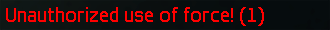
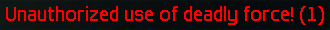
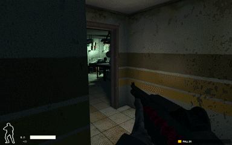
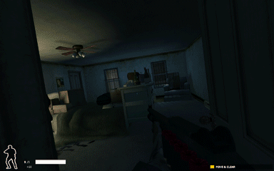

SWAT4 Force Feedback
===
## What is SWAT 4?

SWAT 4 is a game where you play as a SWAT police officer, arresting suspects and restraining hostages in a coordinated, cooperative effort with your fellow officers, who are either with humans in multiplayer or artificial intelligence in single-player.

## What makes SWAT 4 interesting?

Unlike many first-person shooters, you are rewarded for non-violently resolving encounters and minimizing injury and loss of life, both for hostages and suspects. You should shout for compliance, use less-than-lethal measures like pepper spray, tasers, and flashbang grenades, and only fire your weapon as an absolute last resort and in self-defense. Wouldn't it be cool if all police officers acted like this?

## What are some of its problems?

### Penalties

One of the games numerous glaring defects is the extremely inaccurate scoring system. The nature of these high-tension encounters with armed suspects means that you must make millisecond decisions to discharge your weapon. If you fire unnecessarily, you could injure or neutralize a suspect that did not pose a threat to your life, and you will be penalized with an **Unauthorized Use of Force** or **Unauthorized Use of Deadly Force**. However, if you hold your fire and try to talk them down, they could injure or kill you, which causes you to complete the rest of the mission with severely compromised weapon inaccuracy or movement speed, and you will have to replay the mission upon death. The challenge is amplified because you must play the entire mission through without any way to revert to a previous checkpoint, so you must handle each encounter perfectly and hope that the game is fair.

Weighing the outcomes of engagement and restraint gives the game a unique challenge, but its implementation is severely flawed to a degree that ruins the dilemma-solving system and works against a player that is trying to engage with this mechanic. First, the threshold for differentiating between authorized and unauthorized use of force is criminally imprecise. At one end of the spectrum, suspects that have fired at an officer are authorized for neutralization, and at the other end, suspects that are not holding weapons or are holding them at their sides are not authorized for use of force. The game is able to handle these extreme cases well, but the middle ground is where the threat modelling fails far too often. Suspects who are raising a weapon at an officer are inexplicably not valid targets for use of force, despite the clear danger they pose to the officer. If an officer does not immediately fire on a suspect that is raising their weapon, the suspect will shoot and kill the officer before the officer can shout for compliance. In many cases, the animations and AI are so badly synchronized that the suspect will shoot the officer even before their weapon is raised, robbing the player of the ability to observe the situation and make a quick decision, because the information presented by the game is terribly inconsistent. For some incomprehensible reason, there are no difficulty levels or other options the player can adjust to fix the improperly tuned AI, as changing the difficulty level only affects passing score thresholds, and AI behavior is set on a per-mission and per-suspect basis. This effectively locks out the middle and later levels from all but the most masochistic players, which is not inclusive of people who may be interested in this game. Overall, the timing is far too hair-trigger and the enemies too unreliably animated to accomplish the major gameplay goal of forcing players to weigh their options and be decisive. In all but the most obvious cases, the game's threat model is horrendously misaligned with the game mechanics, and its inaccuracy defeats the purpose of trying to play by the game's rules.

### Feedback

To further ruin an already-miserable situation, the experience of the player is so poorly designed that critical feedback about the mission scoring is withheld until the mission has been completed, instead of showing the player's actions and their effects in real time. Punishing a player for behaving counter to the rules of the game is a way to encourage them to master the mechanics. Worse, punishing a player unfairly due to a sloppy scoring system, badly-designed AI, and broken animations causes a serious breach of trust between the game and the player who was trying to improve their skills. Even worse, punishing a player and not letting them retry the encounter to figure out the correct way to deal with the given situation is even more aggravating, and many games suffer from the issue of checkpoints that are not controllable by players, spaced too far apart, or missing entirely. Worst of all, punishing a player 40 minutes after they may or may not have broken a rule, and giving no further information about what exactly the player did wrong, which encounter it was, and when it happened is the exact opposite of how you teach someone. It is impossible to overemphasize how unconscionable it is to mistreat and betray the trust of the people who try to play your games. This irresponsibly stupid decision to omit penalty notifications during gameplay should make everyone who was at the former Irrational Games studio feel bad about themselves. Anyone who has ever instructed a class, raised a child, coached a team, trained a pet, or simply taught anyone anything knows that you always, ALWAYS, ***ALWAYS*** give immediate feedback when someone does something wrong. If you wait and give this feedback after the fact, you are the problem, and it's your fault when they lose respect for you, stop paying attention to your advice, and don't learn how to do it correctly. As a studio that designed interactive experiences, it is unfathomable that Irrational did not understand this fact or chose to ignore it while designing a game that differentiated itself from other shooters by discouraging shooting.

## How can these problems be addressed?

### Immediate feedback

This repository contains a solution for the second problem, delayed negative feedback. When the game is modified to include these changes, the player will receive immediate notifications when they or a human teammate commit an unauthorized use of force or deadly force.

The notification appears as red chat text, along with existing text notifications. It details the type of force (normal or deadly) and how many counts of the violation are currently outstanding in the mission. For example, if you or a human teammate wounds a suspect, you will see the **Unauthorized use of force! (1)** text in red on the left side of the screen.

The number 1 indicates that there is currently 1 count of unauthorized use of force in the mission. If you were to wound a different suspect, you would then see
> Unauthorized use of force! (2)

If you kill a suspect, you will instead see **Unauthorized use of deadly force! (1)**.

### Why does this help?

By immediately showing this information to the player, they are able to judge for themselves whether the ruling was fair. They can learn from the situation and better understand the rules for use of force that are presented in the game. In multiplayer, they can tell which player was even involved. In the common case that the ruling was buggy and incorrect, the player now has enough information to dismiss it with certainty as baseless and inaccurate. Finally, a player who is aiming for a particular score can tell if they have failed the criteria for that score before wasting another 35 minutes in the mission, only to have to redo the entire effort because of defects beyond their control. This approach is drastically less aggravating. We know that people have a finite amount of time and they don't have to spend it playing games, let alone any one particular game, so if we can prevent their time from being wasted when they do choose to engage with a particular game, we have made their lives better.

### Demonstration

See the 1920 × 1200 [body camera footage](Images/bodycam.mp4) of the below incidents.

#### Authorized uses of force and deadly force

The suspect sees the officer and fires three times (missing each time). The officer fires once, knocking the gun out of the suspect's hand and wounding him, and then fires a second time, killing him. This use of deadly force is authorized because the suspect already fired at the officer.

#### Unauthorized uses of force and deadly force

A suspect in a blue shirt is standing with a weapon raised, but does not see the officer and is not aiming the weapon at the officer. The officer fires once, killing the suspect, which was unauthorized because the suspect did not aim or fire at the officer.

A second suspect in a gray shirt with no weapons held pretends to surrender and begins running, and the officer fires three times, wounding the suspect. This should have been reported as an unauthorized use of force, but was not, due to the game's faulty scoring system. The suspect pulls out a weapon and the officer fires a fourth time, neutralizing the suspect. This was recorded as an unauthorized use of deadly force because the suspect was pulling out the weapon but had not yet aimed it at the officer, and the suspect was possibly acting in self-defense.

A suspect is standing with no weapons held and does not see the officer, who fires once around the door jamb. The suspect is wounded and pulls out a weapon, and the officer fires a second time, killing the suspect. As with the previous suspect, this was recorded as an unauthorized use of deadly force because the suspect had not yet aimed their weapon at the officer, and the suspect was possibly acting in self-defense.

## Installation
1. Clone this repository into the game's installation directory.
	- `build.bat` and `Source` should be siblings of the existing `Content` directory.
1. Run `build.bat`.
1. Repeat these steps in any other installations that you would like to connect to in multiplayer.

## Contributions
- Alec Loftus
	- For introducing and sharing his excitement about SWAT 4 with me in 2005.
- Andrew Brindamour
	- For playing SWAT 4 with me and being a great teammate.
	- For inspiration, pair programming, and encouragement while co-developing this modification.
- [SWAT: Elite Force](https://github.com/eezstreet/SWATEliteForce)
	- For showing how to edit to this "fantastic, if horrendously bugged product."
- [Irrational Games](https://en.wikipedia.org/wiki/Irrational_Games)
	- For releasing a game with a great concept and an embarrassingly low-quality implementation.
	- For supplying a Software Development Kit to create modifications.
- [Sierra Entertainment](https://en.wikipedia.org/wiki/Sierra_Entertainment) and [Vivendi Games](https://en.wikipedia.org/wiki/Vivendi_Games)
	- For going out of business before they could publish a watered-down 2015 reboot called "SWAT" that tried too hard to please everybody, ignored all the unique innovations of this game, and was just another bland, featureless shooter that no one played or remembered.
